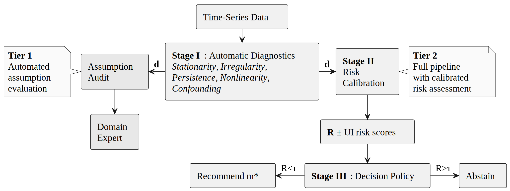

# Causal-Audit

A framework for risk assessment of assumption violations in time-series causal discovery.

[](https://www.python.org/downloads/)
[](https://opensource.org/licenses/MIT)
[]()

> Ruiz, M.¹, Arana-Catania, M.², Ardila, D. R.³ & Ventura, R.¹ (2026).
> *Journal of Causal Inference.*
>
> ¹ ISR, Instituto Superior Técnico, Lisbon &nbsp;
> ² University of Oxford &nbsp;
> ³ Jet Propulsion Laboratory, Caltech

<p align="center">
  
</p>

## Installation

```bash
uv venv .venv --python 3.13
source .venv/bin/activate
uv pip install -e .
```

## Usage

Input: a `pandas.DataFrame` with a `DatetimeIndex`, one column per variable, `NaN` for missing values.

```python
import pandas as pd
from causal_audit import AssumptionAuditor   # Stage I
from causal_audit import RiskQuantifier      # Stage II
from causal_audit import MethodRecommender   # Stage III
from causal_audit import RiskAwareGatekeeper # Stages I → II → III

df = pd.read_csv("data.csv", index_col=0, parse_dates=True)

# Stage I — diagnostics (stationarity, irregularity, persistence, nonlinearity, confounding)
auditor = AssumptionAuditor(alpha=0.05)
evidence = auditor.audit(df)               # → AuditEvidence with per-variable effect sizes

# Stage II — calibrated risk scores with 95 % credible intervals
quantifier = RiskQuantifier()
risk_profile = quantifier.quantify(evidence) # → RiskProfile (6 risks, CrI, ledger)

# Stage III — recommend a method or abstain
recommender = MethodRecommender()
policy, scorecard = recommender.recommend(risk_profile) # → Policy + Scorecard

# Or run all three stages at once:
gk = RiskAwareGatekeeper(random_seed=42)
result = gk.analyze(data=df, output_dir="results/")
print(result["policy"].decision)           # "recommend" or "abstain"
print(result["policy"].recommended_method) # "PCMCI+" or "LPCMCI"
```

Stage I can be used alone for structured assumption auditing in individual studies. The full pipeline adds calibrated risk estimation and decision support.

## Generated Figures

Every call to `gk.analyze()` produces 7 publication-quality figures (IEEE style, 300 DPI, PDF+PNG) in `output_dir/figures/`:

| Figure | Description |
|--------|-------------|
| `prediscovery_summary` | Composite (panels a-e): time series overview, risk profile with CrI, ACF with T_eff, nonlinearity scatter, recommendation |
| `correlation_and_lagged_crosscorrelation` | Contemporaneous Pearson correlation + max lagged cross-correlation matrices |
| `spectral_density` | Power spectral density per variable with dominant period and power fraction |
| `stationarity_diagnostic` | Rolling mean/std with ADF+KPSS verdict in causal discovery language |
| `sample_size_adequacy` | Effective sample size per variable vs. method minimum requirements |
| `assumption_deep_dive` | Per-assumption diagnostic (6 panels) with evidence and recommended action |
| `dependency_network` | Preliminary causal graph (PCMCI+ with ParCorr, tau_max=2) via tigramite |

Style is configurable via `DEFAULT_STYLE` in `causal_audit/plotting/figures.py`. Options: `"ieee"` (default), `"science"`, `"nature"`. Requires `pip install SciencePlots`.

## Synthetic DGP Atlas ([Zenodo](https://zenodo.org/records/19409395))

500 synthetic multivariate time series with controlled assumption violations, designed for benchmarking causal discovery pre-processing and method selection. All families share a VAR(1) base process. Generated 2025-11-30, seed 42.

| Family | Name | Domain | n | N | T | Start date | End date | Violation mechanism | Severity |
|--------|------|--------|---|---|---|------------|----------|---------------------|----------|
| F1 | Clean baseline | Synthetic VAR(1) | 50 | 5–8 | 500–1000 | 2020-01-01 | 2021-05-15 – 2022-09-27 | None | ρ(A) ≤ 0.7 |
| F2 | Structural breaks | Synthetic VAR(1) with regime changes | 50 | 5–8 | 500–1000 | 2020-01-01 | 2021-05-15 – 2022-09-27 | 1–3 regime changes in VAR coefficients | Continuous |
| F3 | Irregular sampling | Synthetic VAR(1) with missingness | 50 | 5–8 | 500–1000 | 2020-01-01 | 2021-05-15 – 2022-09-27 | MCAR / MAR / seasonal gaps | 15–35 % missing |
| F4 | High persistence | Synthetic near-unit-root VAR(1) | 50 | 5–8 | 500–1000 | 2020-01-01 | 2021-05-15 – 2022-09-27 | Near-unit-root spectral radius | ρ(A) ∈ [0.92, 0.98] |
| F5 | Latent confounders | Synthetic VAR(1) with hidden causes | 50 | 5–8 | 500–1000 | 2020-01-01 | 2021-05-15 – 2022-09-27 | L ∈ {1, 2} hidden common causes | σ_conf ∈ {0.3, 0.6, 0.9} |
| F6 | Seasonality | Synthetic VAR(1) with harmonic components | 50 | 5–8 | 500–1000 | 2020-01-01 | 2021-05-15 – 2022-09-27 | Additive harmonic components | P ∈ {12, 24, 52} |
| F7 | Nonlinear | Synthetic nonlinear dynamics | 50 | 5–8 | 500–1000 | 2020-01-01 | 2021-05-15 – 2022-09-27 | tanh / sin / ReLU transforms | Moderate |
| F8 | Non-Gaussian | Synthetic heavy-tailed VAR(1) | 50 | 5–8 | 500–1000 | 2020-01-01 | 2021-05-15 – 2022-09-27 | Student-t or Laplace noise | ν ∈ {3, 5, 10} |
| F9 | Mixed violations | Synthetic multi-violation VAR(1) | 50 | 5–8 | 500–1000 | 2020-01-01 | 2021-05-15 – 2022-09-27 | 2–3 families combined | Multiple high |
| F10 | Boundary cases | Synthetic stress-test VAR(1) | 50 | 3–12 | 200–2000 | 2020-01-01 | 2020-07-19 – 2025-06-23 | Short series / high-dim / sparse / near-unit-root | Stress test |

Generator: `causal_audit_validation/generators/synthetic_atlas_extended_v02.py`.

## Extending

Each stage has a single extension point.

**New method.** Add to `config/method_catalog.yaml`:

```yaml
LPCMCI:
  full_name: "Latent PCMCI"
  citation: "Gerhardus & Runge (2020)"
  implementation: "tigramite"
  assumptions:
    stationarity: { tolerance: "soft", penalty_weight: 0.5 }
    causal_sufficiency: { tolerance: "none" }   # handles latent confounders
  parameters: { tau_max: "data_driven", pc_alpha: 0.01 }
```

Then register its risk thresholds in `c_recommender.py`:

```python
# In METHOD_CONSTRAINTS:
"LPCMCI": {
    "hard_constraints": [
        ("NonstationarityRisk", 0.80, "Requires weak stationarity"),
    ],
    "soft_constraints": [
        ("ConfoundingRisk", 0.90, "Handles latent confounders via PAGs"),
        ("PersistenceRisk", 0.85, "Large tau_max needed"),
    ],
    "base_cost": 2.0,
}
```

**New diagnostic.** Add a method to `a_auditor.py` and wire it in `audit()`:

```python
# In AssumptionAuditor:
def check_measurement_noise(self, df):
    results = {}
    for col in df.columns:
        series = df[col].dropna().values
        # e.g. ratio of high-frequency variance to total variance
        results[col] = {"hf_variance_ratio": float(...)}
    return results

# In audit():
diagnostics["measurement_noise"] = self.check_measurement_noise(df)
```

**New risk dimension.** Three edits: append to `CORE_RISKS` in `b_quantifier.py`, add extraction in `_extract_diagnostic_values()`, and add weights in `calib_v2.yaml`:

```yaml
# In global_parameters.risks:
MeasurementNoiseRisk:
  alpha: -2.0
  diagnostic_weights:
    hf_variance_ratio: { weight: 3.0 }
```

**Recalibrate.** Run your DGPs through Stage I, fit new models, freeze to YAML, and point the gatekeeper to it: `RiskAwareGatekeeper(calib="calib_v3.yaml")`. Scripts: `causal_audit_validation/calibration_v02/`.

See `docs/threat_model.md` for what the framework cannot detect.

## Reproducing paper experiments

```bash
# 1. Synthetic Atlas: generate 500 DGPs, run calibration, cross-validate
python causal_audit_validation/generators/synthetic_atlas_extended_v02.py
python causal_audit_validation/calibration_v02/run_full_atlas_calibration_v02.py
python causal_audit_validation/calibration_v02/run_cross_validation.py

# 2. TimeGraph benchmark (18 categories)
python timegraph_validation/run_validation_v3_final.py

# 3. CausalTime benchmark (3 domains)
python causaltime_validation/run_causaltime_validation.py
```

## Citation

```bibtex
@misc{ruiz2026causalaudit,
  title   = {Causal-Audit: A Framework for Risk Assessment of Assumption
             Violations in Time-Series Causal Discovery},
  author  = {Marco Ruiz and Miguel Arana-Catania and David R. Ardila
             and Rodrigo Ventura},
  year    = {2026},
  eprint  = {2604.02488},
  archivePrefix = {arXiv},
  primaryClass  = {cs.LG},
  doi     = {10.48550/arXiv.2604.02488},
  url     = {https://arxiv.org/abs/2604.02488},
}
```

MIT License
